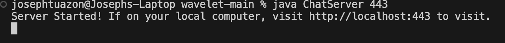
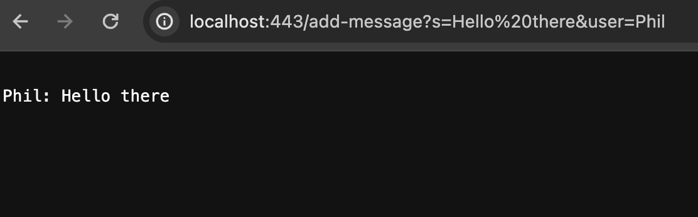
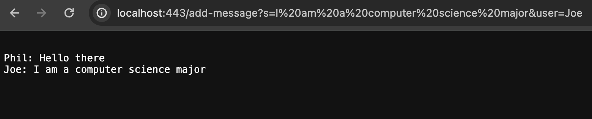

## ChatServer code and using /add-message (part 1)

The methods that are called in this screenshot is: The method that is called in this screenshot is handleRequest because in the server, it checks for arguments which is the '/add-message?s=<message>&user=<name>. This allows a new message to be displayed.

The relavent arguments and the values of the relavant fields of the class are Strings for the values and arguments.

The value of any relavant fields did not change because no value needed to be changed. It only stays as a String

The methods that are called in this screenshot is The methods that are called in this screenshot is: The method that is called in this screenshot is handleRequest because in the server, it checks for arguments which is the '/add-message?s=<message>&user=<name>. This allows a new message to be displayed. There is another step in this screenshot because it checks if a message and user is not empty and it adds a new line when new arguments are passed.

The relavent arguments and the values of the relavant fields of the class are Strings for the values and arguments.

The value of any relavant fields did not change because no value needed to be changed. It only stays as a String

## Part 2

## Part 3 - Something learned in labs from week 2 or 3
During week 2 and 3 from the labs I have done with either my groupmates or doing the lab report is connecting to a server and being able to send the same server to my groupmates. This was very interesting because Throughout my educational career, I have never learned how this worked.
