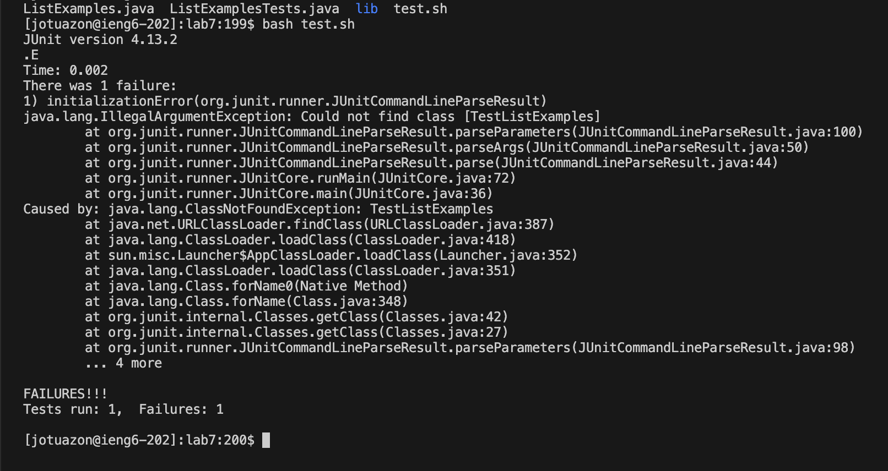
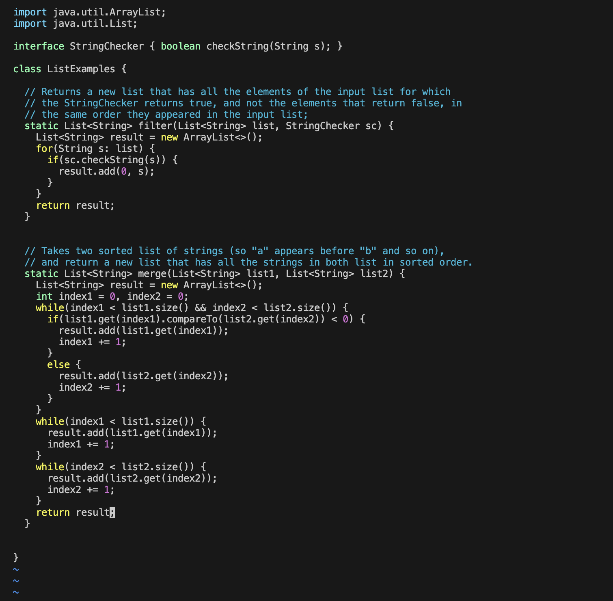
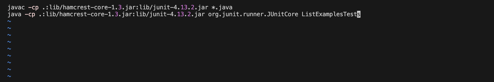
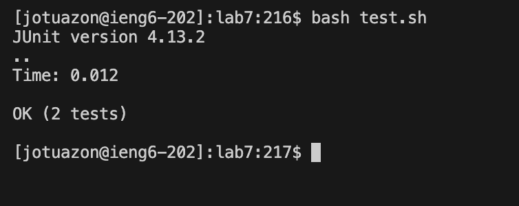
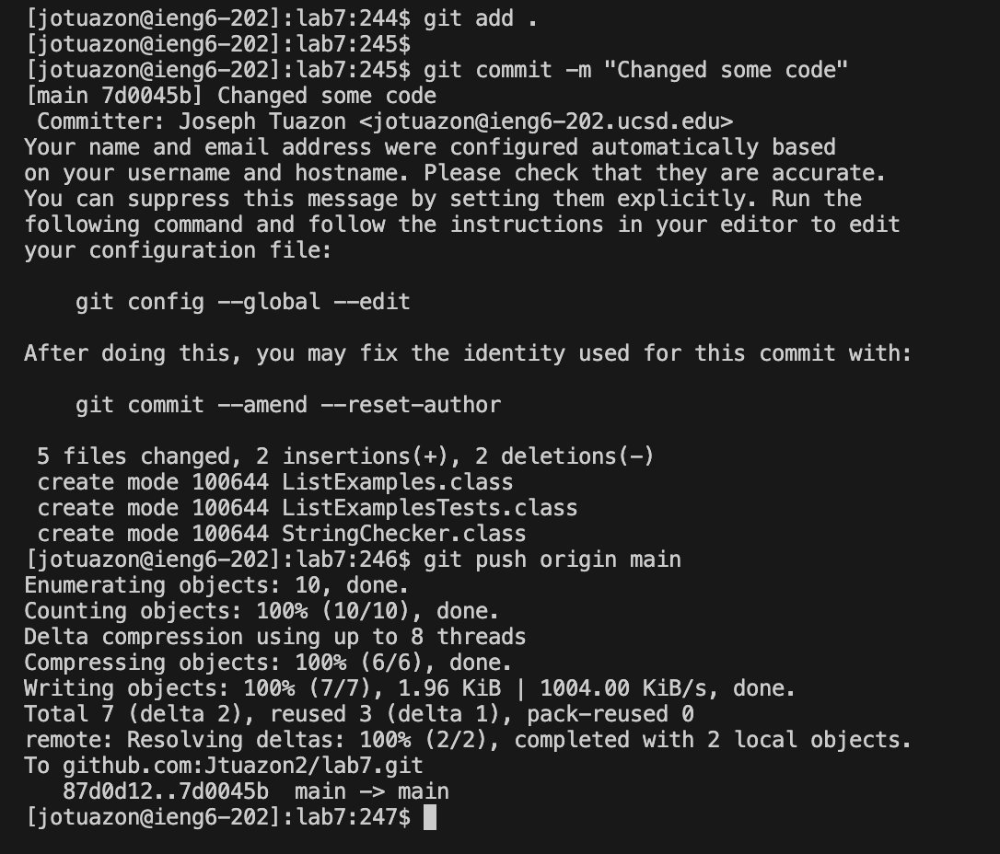
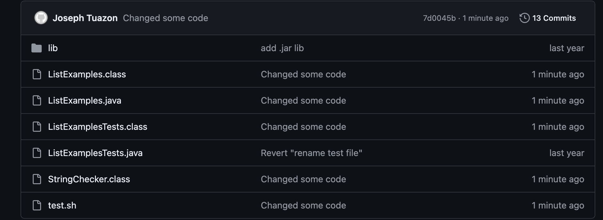

**Log into ieng6**

In order to do this, i typed in `ssh jotuazon@ieng6.ucsd.edu` in order to log into ieng6. 

The key presses I pressed was to type `ssh jotuazon@ieng6.ucsd.edu`

Summary:

**Clone your fork of the repository from your Github account (using the `SSH` URL)**

I cloned and forked the repository then copied and pasted `<command c> + <command v>` while also using the  `git clone` command then pressed `<return>`

Summary: The key presses I used were `<command c>` to copy the repository, `<,command v>` to paste the repository, then pressed `<return>` to clone it.

**Run the tests, demonstrating that they fail**

Key presses/commands: `cd` (to lab7) `<return>`, `ls` (to list out the contents of lab7) `<return>`, then typed `bash test.sh` (to run the tests)

summary: I used the command `cd` to change into the correct directory then used the command `ls` to list out the contents. I then used the commabd `bash test.sh` to test and see that there the test cases was failing.

**Edit the code file to fix the failing test**

Key pressed/commands: `vim test.sh` (to edit and check the file) pressed `<i>` to enter insert pressed `<down> <down>` to move the cursor to the correect line number, pressed `<right> <right> <right> <right> <right> <right> <right> <right>` to change the `TestListExample` to `ListExamplesTest` becasue that is the correct name for the test file pressed `<esc>` to exit insert mode pressed `<:>` and typed `wq` to save the edit, `vim ListExamples.java` (to use the vim editor to correct the code), pressed `<down> <down> <down> <down> <down> <down> <down> <down> <down> <down> <down> <down> <down> <down> <down> <down> <down>` (to go to the correct line the error was on), pressed `<i>` to enter insert mode (to change the code), `<right>` around 4 times (to move the cursor to the correct spot), pressed `<delete>` to delete the characters (to remove the wrong part of the code), pressed `<2>` (the correct index number to updtate), pressed `<esc>` to exit insert mode pressed `<:>` and typed `wq` to save the changes.

Summary: the command `vim` allows me to edit the code in terminal but to actually edit it I needed to press either `<up>` `<down>` `<left>` or `<right>` to move the cursor. When I moved the cursor to the correct position I pressed `<i>` to enter insert and changed the error.

**Run the tests, demonstrating that they now succeed**

Key presses/commands: pressed `<up> <up>` to get `bash test.sh` then pressed `<return>`

Summary: In order to rerun the command without retying it, I pressed `<up>` to see all the previous commands

**Commit and push the resulting change to your Github account (you can pick any commit message!)**

Keys presses/commands: typed `git add .` then pressed `<return>` in order to tell git which changes I want to include. Then typed `git commit -m "Changed some code"` then pressed `<return>` to create a message to see that in git hub the changes were made. Then typed `git push origin main` then pressed `<return>` to allow the changes to appear in git hub.

Summary: In order to make changes to the github, I had to type three commands , `git add .` then `git commit` and `git push`. These commands allowed me to make the changes appear in git hub.
