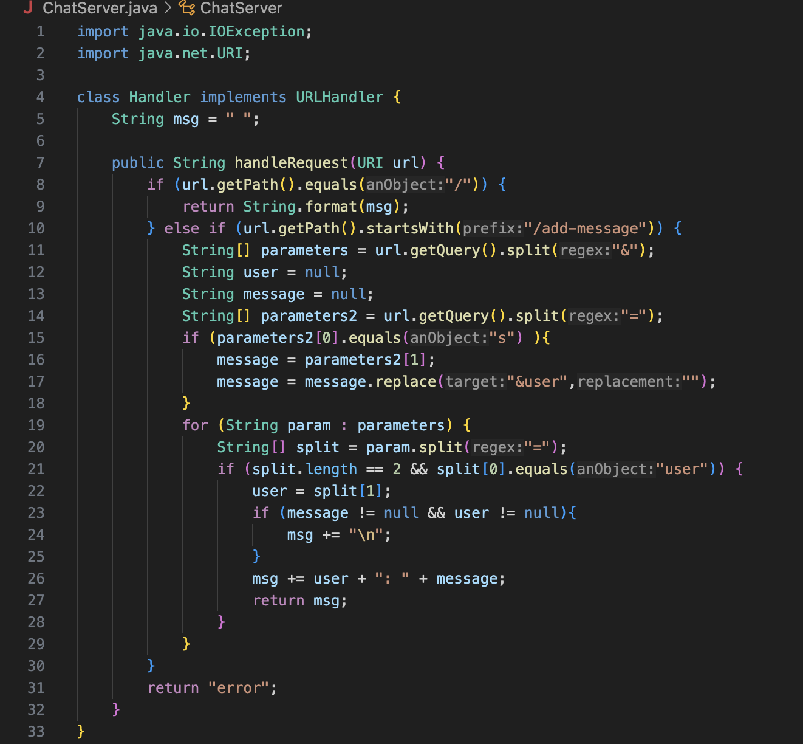

## ChatServer code and using /add-message (part 1)



The method that is called in this screenshot is ```handleRequest``` that takes in a url as a parameter. This method checks for arguments in the server which is the '/add-message?s=(message)&user=(name) and splits it at the "=" and "&. This allows a new message to be displayed.

The relavent arguments is the url and the values of the relavant fields of the class are Strings for the values and arguments is There are also relevant variables such as ```user``` and ```message``` because both of these variables are updated with whatever is inputed in the query.

The value of any relavant fields changed is the ```User``` and ```message``` because they are being updated when new parameters are being passed in the server. 

The method that is called in this screenshot is ```handleRequest``` that takes in a url as a parameter. This method checks for arguments in the server which is the '/add-message?s=(message)&user=(name) and splits it at the "=" and "&. This allows a new message to be displayed. There is another step in this screenshot because it checks if a message and user is not empty and it adds a new line when new arguments are passed.


The relavent arguments is the url and the values of the relavant fields of the class are Strings for the values and arguments. There are also relevant variables such as ```user``` and ```message``` because both of these variables are updated with whatever is inputed in the query. There is also a method that checks if ```User``` and ```message``` is not null and makes a new line for a new message that is inputed.

The value of any relavant fields changed is the ```user``` and ```message``` because new parameters are being inputed which changed the previous values of ```user``` and ```message```.

## Part 2

'ls' with absolute path to private key: 


'ls' to with absolute path to public key for ieng6:


log in to ieng6 no password:


## Part 3 - Something learned in labs from week 2 or 3
During week 2 and 3 from the labs I have done with either my groupmates or doing the lab report is connecting to a local server and manipulate what is in that server such as the /increment or /add?count=(number) and being able to send the same server to my groupmates. This was very interesting because Throughout my educational career, I have never learned how this worked.
