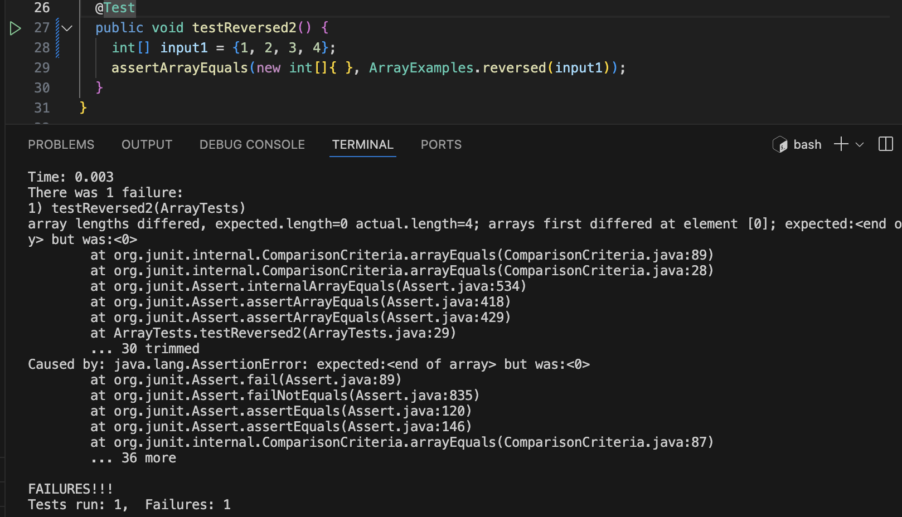
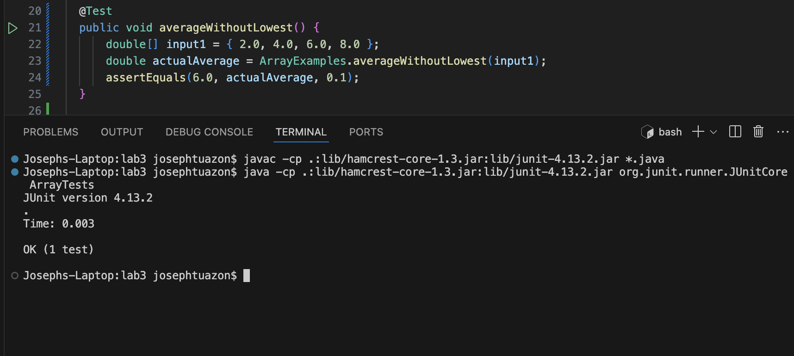

## Part 1 - Bugs
1. A failure inducing bug as a junit test and any accociated code
   - A failure inducing bug as a JUnit test is when testing the reversed method because when inputing a non-empty array it causes a failure in a test case
   code:
```
  @Test
  public void testReversed() {
    int[] input1 = { 1, 2, 3, 4 };
    assertArrayEquals(new int[]{ 4, 3, 2, 1 }, ArrayExamples.reversed(input1));
  }
}
```


3. An input that doesn't induce a failure as a JUnit test and any associated code
   - An input that does not induce a failure asa JUnit test is using the array `{2.0, ,4.0, 6.0, 8.0}` for the average without lowest because it does not cause a failure in the test case
  
code:
```
  @Test 
  public void averageWithoutLowest() {
      double[] input1 = { 2.0, 4.0, 6.0, 8.0 };
      double actualAverage = ArrayExamples.averageWithoutLowest(input1);
      assertEquals(6.0, actualAverage, 0.1);
  }
```


4. The sympton, as the output of running the two tests above (provide a screenshot -- one test should pass and the other should fail)

Fail: 
   
Pass: 
   
   

7. The bug, as the before-and-after code change required to fix it (as two code blocks in markdown)

old code that causes the bug:
```
  static int[] reversed(int[] arr) {
    int[] newArray = new int[arr.length];
    for(int i = 0; i < arr.length; i += 1) {
      arr[i] = newArray[arr.length - i - 1];
    }
    return arr;
  }
```

new code: 
```
  static int[] reversed(int[] arr) {
    int[] newArray = new int[arr.length];
    for(int i = 0; i < arr.length; i += 1) {
      newArray[i] = arr[arr.length - i - 1];
    }
    return newArray;
  }
```


9. Briefly describe (2-3 sentences) why the fix addresses the issue
    - this fixed the issue because in the old code, it was trying to update the array with an empty array which was wrong because we needed to update the array with new values. What I did is I changed it so that it would update the new array with the contents of the old array however in reverse.


## part 2 - Researching Commands

choose either less, find, and grep and find 4 interesting command line options or alternate ways to use the single command you choose. For each of those options give 2 examples of using it on files and directories from ./technical. show example as a code block. 

The command `find` recursiely traverse the given path and lists all files in that directory and subdiretctories.

1. `find type` causes `find` select files
```find -type f``` - this slecets the files that is in the directory

output:
```
./chapter-13.4.txt
./chapter-13.5.txt
./chapter-13.1.txt
./chapter-13.2.txt
./chapter-13.3.txt
./chapter-3.txt
./chapter-2.txt
./chapter-1.txt
./chapter-5.txt
./chapter-6.txt
./chapter-7.txt
./chapter-9.txt
./chapter-8.txt
./preface.txt
./chapter-12.txt
./chapter-10.txt
./chapter-11.txt
```
```find . -type d``` - this selects the directories that was used

output:
```
./.vscode/extensions/redhat.java-1.30.0-darwin-arm64/jre/17.0.10-macosx-aarch64/legal/java.security.sasl
./.vscode/extensions/redhat.java-1.30.0-darwin-arm64/jre/17.0.10-macosx-aarch64/legal/jdk.net
./.vscode/extensions/redhat.java-1.30.0-darwin-arm64/jre/17.0.10-macosx-aarch64/legal/jdk.jsobject
./.vscode/extensions/redhat.java-1.30.0-darwin-arm64/jre/17.0.10-macosx-aarch64/legal/jdk.zipfs
./.vscode/extensions/redhat.java-1.30.0-darwin-arm64/jre/17.0.10-macosx-aarch64/legal/jdk.dynalink
./.vscode/extensions/redhat.java-1.30.0-darwin-arm64/jre/17.0.10-macosx-aarch64/legal/java.compiler
./.vscode/extensions/redhat.java-1.30.0-darwin-arm64/jre/17.0.10-macosx-aarch64/legal/java.xml
```


3. `find -empty` checks if a current directory is empty
  ``` find /Users/josephtuazon/docsearch/technical/911report -type f -empty```

   ```find /Users/josephtuazon/docsearch/technical/biomed -type f -empty```

   output: there is no that is printed because there are no empty files or directories

5. `find -delete` Deletes found files and/or directories

6. `find -x` Prevents `find` from descending into directories that have a device number different than that of the file from which the descent began.

CITE your sources via a url or description on where you found it.
https://math2001.github.io/article/bashs-find-command/


