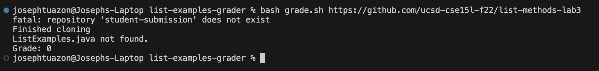
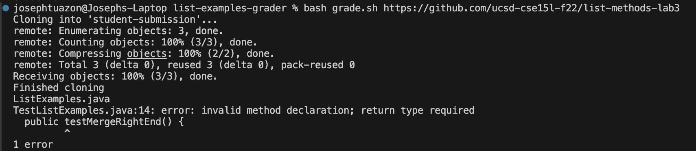
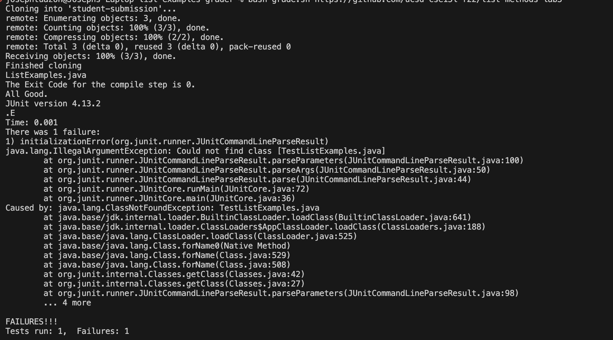
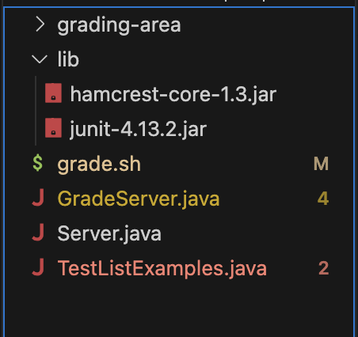

## Part 1

Student: I am having trouble figuring out why my output does not seem like it is correct, it should show the test case and which tests fail and pass. I tried different ways of debugging the code but I still can not solve this problem please help. I think there is a bug in the code. Here is the code and the output. 

```
CPATH='.:lib/hamcrest-core-1.3.jar:lib/junit-4.13.2.jar'

rm -rf student-submission
rm -rf grading-area

mkdir grading-area

git clone student-submission
echo 'Finished cloning'


# Draw a picture/take notes on the directory structure that's set up after
# getting to this point

# Then, add here code to compile and run, and do any post-processing of the
# tests

# step 2: Check that the student code contains The ListExamples.java
if [[ -f student-submission/ListExamples.java ]]
then
    echo "ListExamples.java"
else 
    echo "ListExamples.java not found."
    echo "Grade: 0"
    exit
fi
# step 3: put all relevant files into the grading_area directory
    #TestListExamples.java, ListExamples.java, lib directory 

cp TestListExamples.java student-submission/ListExamples.java grading-area
cp -r lib grading-area

# step 4: compile the java files and checked if they compiled successfully
cd grading-area
javac -cp $CPATH *.java


if [[ $? -eq 0 ]] 
then
    echo "The Exit Code for the compile step is $?."
    echo "All Good."
    javac -cp .:lib/hamcrest-core-1.3.jar:lib/junit-4.13.2.jar *.java 
    java -cp .:lib/hamcrest-core-1.3.jar:lib/junit-4.13.2.jar org.junit.runner.JUnitCore TestListExamples.java 

else
    echo "The Exit Code for the compile step is $?."
    echo "There was an error compiling"
    echo "Grade: FAILED!"
fi

# step 5: run the tests and report the grade based on the test result.
```


Tutor: This could be a problem with the argument with the Git clone because the parameter that is passed, which is a repository, is in the first parameter. When trying to do commands in bash and there are arguments, you can try using `$1` up to `9` which represents the arguments so `1` represents the first argument and `$9` represents the ninth argument.

Student: I just tried that right now and it seem like it work however I got another bug but this time in a .java file. Here is the code and output.

```
import static org.junit.Assert.*;
import org.junit.*;
import java.util.Arrays;
import java.util.List;

class IsMoon implements StringChecker {
  public boolean checkString(String s) {
    return s.equalsIgnoreCase("moon");
  }
}

public class TestListExamples {
  @Test(timeout = 500)
  public testMergeRightEnd() {
    List<String> left = Arrays.asList("a", "b", "c");
    List<String> right = Arrays.asList("a", "d");
    List<String> merged = ListExamples.merge(left, right);
    List<String> expected = Arrays.asList("a", "a", "b", "c", "d");
    assertEquals(expected, merged);
  }
}
```


Tutor: It seems like you are not returning anything in the testMergeRightEnd() method. You can either make it return something or make it a void method. Being a void means that you dont have to return anything essentially.

Student: Thank you very much, it started to work now.


**File and Directory Structure**



**Contents of file before fixing the bug**
TestListExamples.java file: 
```
import static org.junit.Assert.*;
import org.junit.*;
import java.util.Arrays;
import java.util.List;

class IsMoon implements StringChecker {
  public boolean checkString(String s) {
    return s.equalsIgnoreCase("moon");
  }
}

public class TestListExamples {
  @Test(timeout = 500)
  public testMergeRightEnd() {
    List<String> left = Arrays.asList("a", "b", "c");
    List<String> right = Arrays.asList("a", "d");
    List<String> merged = ListExamples.merge(left, right);
    List<String> expected = Arrays.asList("a", "a", "b", "c", "d");
    assertEquals(expected, merged);
  }
}
```

grade.sh file:
```
CPATH='.:lib/hamcrest-core-1.3.jar:lib/junit-4.13.2.jar'

rm -rf student-submission
rm -rf grading-area

mkdir grading-area

git clone student-submission
echo 'Finished cloning'


# Draw a picture/take notes on the directory structure that's set up after
# getting to this point

# Then, add here code to compile and run, and do any post-processing of the
# tests

# step 2: Check that the student code contains The ListExamples.java
if [[ -f student-submission/ListExamples.java ]]
then
    echo "ListExamples.java"
else 
    echo "ListExamples.java not found."
    echo "Grade: 0"
    exit
fi
# step 3: put all relevant files into the grading_area directory
    #TestListExamples.java, ListExamples.java, lib directory 

cp TestListExamples.java student-submission/ListExamples.java grading-area
cp -r lib grading-area

# step 4: compile the java files and checked if they compiled successfully
cd grading-area
javac -cp $CPATH *.java


if [[ $? -eq 0 ]] 
then
    echo "The Exit Code for the compile step is $?."
    echo "All Good."
    javac -cp .:lib/hamcrest-core-1.3.jar:lib/junit-4.13.2.jar *.java 
    java -cp .:lib/hamcrest-core-1.3.jar:lib/junit-4.13.2.jar org.junit.runner.JUnitCore TestListExamples.java 

else
    echo "The Exit Code for the compile step is $?."
    echo "There was an error compiling"
    echo "Grade: FAILED!"
fi
```

**Command Lines Used**

`bash https://github.com/ucsd-cse15l-f22/list-methods-lab3`

`bash https://github.com/ucsd-cse15l-f22/list-methods-compile-error`

**Description of what to edit to fix the bug**

In the file grade.sh, you needed to add `$1` in the code `git clone student-submission` because `$1` represents the first argument that is passed which is the url to a git clone repository.

In the file, TestListExamples.java, we had to make `public testMergeRightEnd()` a void method because it returns nothing and would cause an error if it was not a void method because it would need to return something.

## Part 2 Reflection

Throughout the second half of this Quarter there are many things that I have learned such as using a code editor such as vim, or even making my own mini auto grader. However, the most interesting thing that I have learned is the vim editor. Using vim was extremrely interesting because it feels completely different then actually coding or editing the code itself. There are many different inputs, or commands you can use in vim to make editing and finding a certain line of code a lot easier, especially if there is a lot of lines. I also learned how in coding, there are many ways to interpret the way to build code, such as using terminal entirely via command lines, or just making java files and creating code that way.


